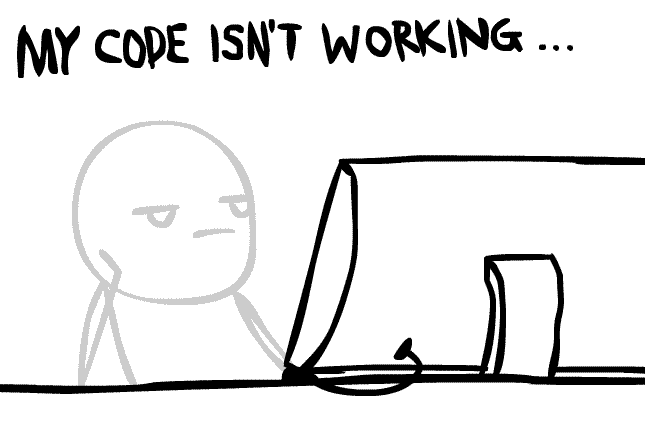

<h1 align="center"> Hey there :wave:, I'm Krishna </h1>

  

<h1 align="center"> </h1> 

<!-- 
- I’m currently working on 
- I’m currently learning 
- 👯 I’m looking to collaborate on ...
- 🤔 I’m looking for help with ...
- 💬 Ask me about ...
- 📫 How to reach me: ...
- 😄 Pronouns: ...
- ⚡ Fun fact: ... -->
